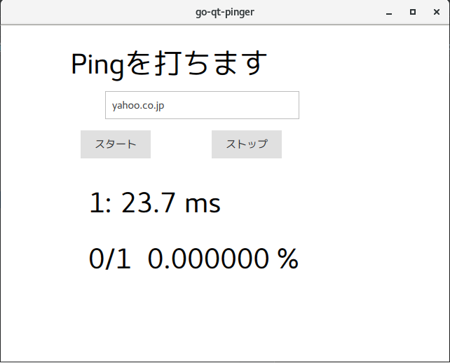

# go-qt-pinger
QtのGoバインディングを使ってPingを打つソフト

## ビルド
1. https://github.com/therecipe/qt に従ってQtやGo言語をインストールします。
2. Linux上でLinux向けにビルドするときは、`deploy.sh` を実行してください。エラーが出たら頑張って修正してください。
3. Windows上でWindows向けにビルドするときは、dockerなどを使う必要があります。https://github.com/therecipe/qt/wiki/Deploying-Windows-to-Windows-64-bit-Shared この辺をみてください。
4. オススメはLinux上でLinuxやmacOSやWindows向けにコンパイルすることです。dockerなどもWindowsより簡単に扱えそう

## todo
Qt ChartsをQMLで使用する場合に、`C++`だと`.pro`ファイルになんか追記するらしいけど、`Go`だとどう書けば良いんだろう

## スクショ
